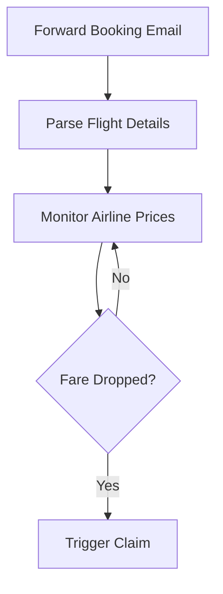

## Overview

JetBack automates the process of monitoring your booked flights for price drops and securing refunds or credits from airlines. You forward your booking confirmation once, and JetBack handles the rest—no manual checking or claim filing required. This guide covers the core features: automatic fare drop detection, refund claim filing, instant notifications, and savings tracking.

<Callout kind="tip">
Enable push notifications in your app settings to stay updated on every credit secured without checking manually.
</Callout>

## Key Features

Explore JetBack's main capabilities through these feature cards.

<Columns cols={3}>
  <Card title="Automatic Fare Detection" icon="zap">
    JetBack continuously scans airline prices for your booked flights and detects drops instantly.
  </Card>
  <Card title="Refund Claims" icon="trending-down">
    Automatically files claims for credits or refunds on your behalf, handling all airline communications.
  </Card>
  <Card title="Instant Notifications" icon="notification">
    Receive real-time alerts when a credit is secured, so you always know your savings.
  </Card>
</Columns>

<Image
  src="https://getjetback.com/images/hero-illustration.svg"
  alt="JetBack hero illustration showing flight monitoring and savings"
  width="800"
  height="400"
/>

## Automatic Fare Drop Detection

JetBack monitors airfares daily after you add a booking. Here's the process:

<Expandable title="Advanced Detection Settings" default-open="false">
You can adjust monitoring frequency in app settings for high-frequency routes.
</Expandable>

## Filing Refund and Credit Claims

Follow these steps to set up claims, with platform-specific instructions.

<Steps>
  <Step title="Add Booking" icon="upload">
    Forward your confirmation email to `claims@jetback.com`.
  </Step>
  <Step title="Verification" icon="shield-check">
    JetBack verifies flight details automatically.
  </Step>
  <Step title="Claim Submission" icon="send">
    Claims file within minutes of detecting a drop.
  </Step>
</Steps>

<Tabs>
  <Tab title="iOS" icon="apple">
    Download from the [App Store](https://apps.apple.com/us/app/jetback-flight-price-tracker/id6744909694).
    
    Open JetBack, tap "Add Flight," and scan or forward your email.
  </Tab>
  <Tab title="Android" icon="monitor">
    Get it on [Google Play](https://play.google.com/store/apps/details?id=com.getjetback.android).
    
    Launch the app, select "Import Booking," and paste your confirmation details.
  </Tab>
</Tabs>

## Instant Notifications

Stay informed effortlessly:

- **Push Alerts**: Immediate in-app and device notifications.
- **Email Summary**: Daily/weekly recaps of activity.
- **Savings Breakdown**: Details on claim amounts and airlines.

<Callout kind="success">
Users report averaging $50+ in credits per trip—your results may vary by route and timing.
</Callout>

## Tracking Accumulated Savings

View your total savings in the app dashboard.

| Metric          | Description                          | Example Value |
|-----------------|--------------------------------------|---------------|
| Total Credits   | Sum of all secured refunds           | $245.75      |
| Active Claims   | Pending airline responses            | 3             |
| Flights Monitored | Bookings under watch                | 12            |
| Success Rate    | Claims approved vs. filed            | 92%           |

<Expandable title="Export Savings Data">
Download CSV reports from the dashboard for tax or budgeting purposes.
</Expandable>

## Next Steps

<Columns cols={2}>
  <Card title="Get Started" icon="rocket" href="/quickstart">
    Set up your first booking in under 2 minutes.
  </Card>
  <Card title="FAQ" icon="help-circle" href="/faq">
    Common questions about claims and monitoring.
  </Card>
</Columns>